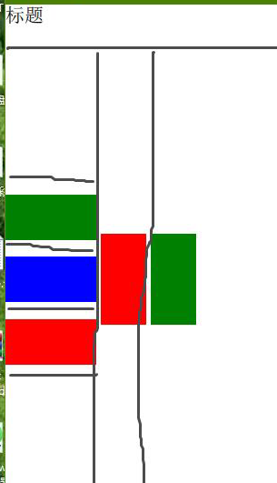

## 一、布局的几种方式

&emsp;&emsp;QML的组件布局有几种方式：普通坐标（x、y、width、height）、锚布局、定位器、布局管理器 这几种。

&emsp;&emsp;普通坐标：最直接和方便，但所有组件的位置都得你手算，而且无法自适应屏幕；

&emsp;&emsp;锚布局：定义组件和组件之间的位置和大小比较方便，一般最常用的就是anchors.fill和anchors.centerIn，分别是填充满某（父）组件或显示到某（父）组件中央；

&emsp;&emsp;定位器：有Column、Row等，它和布局Layout的区别是它只管位置坐标不管大小；

&emsp;&emsp;布局管理器：这个是我们的重点，用会了布局管理器，做啥界面都胸有成竹、游刃有余，它接管了组件的位置和大小，并提供了丰富的属性来定义和自适应屏幕的变化下的组件形状；

## 二、布局管理器Layout

&emsp;&emsp;篇幅关系，我这里只简单的讲一下构建方法和一些常用附加属性，还有一些坑，其他的知识点请移步Qt官方教程，那个详细又啰嗦。

&emsp;&emsp;布局管理器最常用的就是RowLayout、ColumnLayout和GridLayout，分别是行布局（组件都在一行）、列布局（组件都在一列）和网格布局。

&emsp;&emsp;一个完整的布局，是这三个布局管理器有顺序的层次关系构建而成的，比如我们要做一个类似这种的布局：



那我们闹钟需将这个具体的布局结构抽象为布局组件代码的嵌套：

&emsp;&emsp;1、首先整体布局是一个上下结构的（标题和下面一大块），那根布局我们用ColumnLayout；

&emsp;&emsp;2、下面的布局中，我们看到它又是左右行结构的，那么使用的是RowLayout；

&emsp;&emsp;3、继续深入，我们看到左下方的布局又是上下列结构的，那么使用的是ColumnLayout；

&emsp;&emsp;4、同理，右边又是一个左右行结构，那就是RowLaout；

&emsp;&emsp;那么，整个布局的嵌套结构应该是：

```
。。。
ColumnLayout {
  Text {}	//标题
  RowLayout {
    ColumnLayout {
      Rectangle{}
      Rectangle{}
      Rectangle{}
    }
    RowLayout {
      Rectangle{}
      Rectangle{}
    }
  }
}
```

## 三、Layout属性

&emsp;&emsp;有了大体的结构，剩下的就是填属性来调整各布局的宽高，常用的附加属性有：

```
Layout.preferredWidth: 最合适宽度像素
Layout.preferredHeight: 最合适高度像素
Layout.maximumWidth: 最大宽度像素
Layout.maximumHeight: 最大高度像素
Layout.minimumWidth: 最小宽度像素
Layout.minimumHeight: 最小高度像素
Layout.fillWidth: 是否填充满宽度
Layout.fillHeight: 是否填充满高度
Layout.alignment: 对齐方式（比如Qt.AlignHCenter | Qt.AlignTop）
```

注意：

1、以上的属性都可以缺省，而preferredWidth（Height同理）缺省的话，会从width和implicitWidth依次选择。

2、根布局组件需要用坐标或锚布局来定义大小；

3、布局内组件的直接子组件才可以使用Layout附加属性；

4、如果一个布局组件里有多个fillWidth（Height同理）为true的组件，那么它们都会自动拉升，比例为preferredWidth之比。

## 四、加点难度

我们这样定义的布局和组件都是静态的，如果我们想动态创建组件并加入这个布局该怎么做？方案有两个：

1、动态创建组件：

动态创建的组件的父组件设置为布局组件即可，不过顺序得注意，最后增加的肯定在最后面；

2、使用Repeater：

Repeater组件可以根据model来自动创建多个组件，你直接修改model就能新增或减少组件，非常方便，而且它有个modelData属性，根据model的不同类型值也不同（比如如果model如果为数字，则它为下标）；
