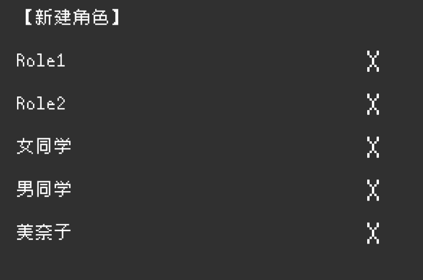
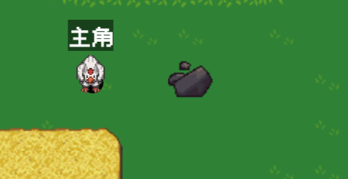

## 关于角色函数

* 角色函数包括`创建角色`，`控制角色`，`移除角色`(这里暂且不讨论战斗人物相关函数)。
* 为了更好区分主角与npc，鹰歌使用了`hero`与`role`两种函数作为区分。

## 创建主角/角色

以下为创建主角的例子：

```javascript
game.createhero({RID: "资源ID", $name: "主角名字",$speed:速度});
```

我们将重要的参数陈列出来：

* **RID**：RID是游戏内部的资源ID，他会引用`角色`一栏的资源，如图，`Role1`，`美奈子`等都是RID

* **$name**：$name(别忘了`$`号)表示角色名称，会显示在一个角色的头顶上(当然也可以不显示每次)


* **函数`createhero`,`createrole`参数及其说明**：

> 无特殊说明，函数前均省略game类。标注默认则表示系统会默认设置该参数

|  参数   | 解释  |  类型  |
|  :----  | ----  | ----: |
| RID  | 资源ID | `String` |
| $name  | 角色名称 | `String` |
| $x  | 像素坐标x | `number` |
| $y  | 像素坐标y | `number` |
| $bx  | 地图块坐标x | `number` |
| $by  | 地图块坐标y | `number` |
| $action  | 为0表示暂时静止<br>为1表示随机移动<br>为-1表示禁止移动和操作<br>为2表示定向移动 | `number` |
| $direction  | 面向方向（0、1、2、3分别表示上右下左） | `number` |
| $showName  | 为是否头顶显示名字(默认true) | `Bool` |
| $id  | 用于角色特征识别(默认$name) | `String` |
| $penetrate  | 是否可穿透 | `Bool` |
| $realSize  | 影子大小(默认) | `number` |
| $start  | 表示角色是否自动动作（true或false) | `String` |

## 控制/获取 主角/角色

来看一个示例，它展示如何修改和获取角色属性：

```javascript
//让主角移动到(10,10)
game.hero(0,{$targetBx:10,$targetBy:10});
//获取id为npc的角色属性
var npc = game.role(`npc`);
//获取地图坐标x
var npcX = npc.$bx;
```

* **函数`hero`，`role`参数及其说明**：

* 第一个参数：

|  参数   | 解释  |  类型  |
|  :----  | ----  | ----: |
| $id  | 从id获取属性<br>为0表示主角 | `String` |

* 内部参数：

|  参数   | 解释  |  类型  |
|  :----  | ----  | ----: |
| $x  | 像素坐标x | `number` |
| $y  | 像素坐标y | `number` |
| $bx  | 地图块坐标x | `number` |
| $by  | 地图块坐标y | `number` |
| $targetBx  | 定向移动地图块坐标x | `number` |
| $targetBy  | 定向移动地图块坐标y | `number` |
| $$nActionType  | 角色是否运动<br>10为正在运动 | `number` |
| $targetX  | 定向移动像素坐标x | `number` |
| $targetY  | 定向移动像素坐标y | `number` |
| $action  | 为0表示暂时静止<br>为1表示随机移动<br>为-1表示禁止移动和操作<br>为2表示定向移动 | `number` |
| $direction  | 面向方向（0、1、2、3分别表示上右下左） | `number` |
| $showName  | 为是否头顶显示名字 | `Bool` |
| $realSize  | 影子大小 | `number` |
| $start  | 表示角色是否自动动作（true或false) | `String` |

* **删除主角/角色**

这个非常简单，不多赘述

```javascript
game.delrole(0); //0表示主角
game.delrole(`npc`);
```

|  参数   | 解释  |  类型  |
|  :----  | ----  | ----: |
| $id  | 填入删除角色的id | `String` |

## 练习

制作一个游戏，包括：

* 创建主角“鹰歌”

* 创建NPC“小明”

`main.js`参考代码

```javascript
//游戏开始脚本（开始时调用）
function *$start() {
    game.loadmap('填入你的地图名');
    
    //下面是练习内容
    //...
}
```

人物函数用法是不是很简单呢？接下来我们学习地图类函数！
